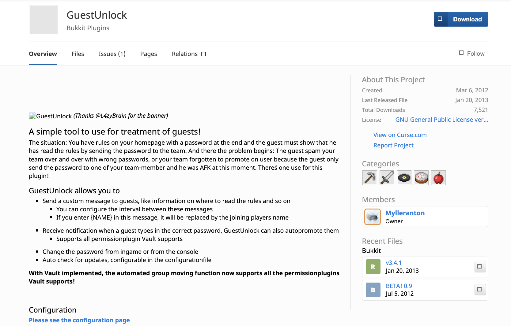
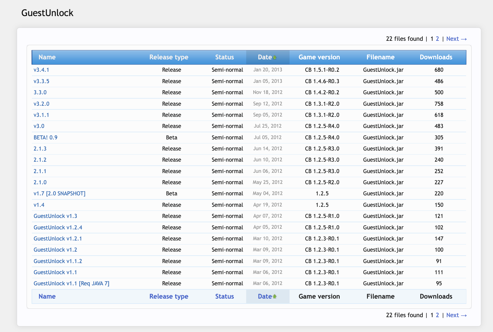

# GuestUnlock (active 2012-2013)
## What is (was) it?
GuestUnlock was a Bukkit-plugin (*bukkit was one of the most popular Minecraft server implementations*) for managing the new-member approval workflow for administrators of the server. As every server had its own particular set of rules and conventions, it was very common to hide a password/pass-phrase in the rules, that new members had to present administrators with to gain building rights on servers.

GuestUnlock was initially created as a way for:
- New members to send the pass-phrase to administrators outside the general chat (thus not revealing the password to other new members)
- Administrators to easily manage password rotations

Later, the plugin was amended to facilitate automatic build right promotion upon entry of correct password by integrating with *Vault*, the most commonly used permission management system for Bukkit servers.

At its peak, the plugin was used by around 500-1000 server installations, and the project overall had around 7500 downloads over its lifetime.

# Original documentation [on project site](https://dev.bukkit.org/projects/guestunlock)
Sadly, the project site seems to have died out, but here is a sneak peak of how it looked like along with the original documentation.


## Releases
Just leaving this here for nostalgic reasons, fetched using the [WayBack Machine](https://archive.org/web/).


## A simple tool to use for treatment of guests!
The situation: You have rules on your homepage with a password at the end and the guest must show that he has read the rules by sending the password to the team. And there the problem begins: The guest spam your team over and over with wrong passwords, or your team forgotten to promote on user because the guest only send the password to one of your team-member and he was AFK at this moment. There´s one use for this plugin! 

### GuestUnlock allows you to
Send a custom message to guests, like information on where to read the rules and so on
You can configure the interval between these messages
If you enter {NAME} in this message, it will be replaced by the joining players name
Receive notification when a guest types in the correct password, GuestUnlock can also autopromote them
Supports all permissionplugin Vault supports
Change the password from ingame or from the console
Auto check for updates, configurable in the configurationfile
With Vault implemented, the automated group moving function now supports all the permissionplugins Vault supports!

### Configuration
Default `config.yml` file:
```yml
Guest:
    JoinMessage: Welcome Guest, please read the rules, then send the password /guestunlock <password>
    Message: Welcome Guest, please read the rules, then send the password /guestunlock <password>
    MessageInterval: 30

Admin:
    Password: guestunlock
    Debug: false
    CheckForPass: false
    CheckForUpdate: true
PermissionSystem:
    Vault:
        Enable: true
        BuildGroup: builder
        UseSpecificWorld: false
        RemoveOldGroup: true
```

#### Explanation
**Guest**
- `Guest.JoinMessage`: This is the message that will be displayed when a player with the permission `guestunlock.guest` logs in.
- `Guest.Message`: This is the message that will be displayed to all players with the permission `guestunlock.guest`, every X seconds.
- `Guest.MessageInterval`: This is the amount of seconds inbetween the `Guest.Message`-messages.

**Admin**
- `Admin.Password`: This is the correct password.
- `Admin.Debug`: If `true`, GuestUnlock will print out debug and additional information to the log.
- `Admin.CheckForPass`: If `true`, GuestUnlock will detect if any user writes the password in the chat. GU will then cancel the message, and notify any moderators with the permission `guestunlock.moderator`.
- `Admin.CheckForUpdate`: If `true`, GuestUnlock will check for updates on server-restart/reload. When a player with `guestunlock.moderator` logs in, he or she will be notifyed if there is an update.

**PermissionSystem**
- `PermissionSystem.Vault.Enable`: If `true`, GuestUnlock will try to hook into Vault. If the hook is created successfully, it will automaticly move a player with the permission `guestunlock.guest` to the specified group when he enters a correct password. Since Vault detects most of the Permissionpluigns, GuestUnlock is therefor compatible with them.
- `PermissionSystem.Vault.BuildGroup`: This is the group a guest will be moved to, if `PermissionSystem.Vault.Enable` is true.
- `PermissionSystem.Vault.UseSpecificWorld`: IMPORTANT If you are using a pluign like bPermission, who differs permissions per world, this must be true. Are you using PEx, who has a global permission handling, then set this to false. If this is misconfigured, the automated group moving function may not work.
- `PermissionSystem.Vault.RemoveOldGroup`: When a guest enters the correct password, and he is moved to the BuildGroup, shall GuestUnlock remove his old group? Ex. Player1 has the group `default`. He enters the correct password and is moved to the group `builder` (the group `builder` is added to him). If this is false - Player1 will now have the groups `default` & `builder`. If this is on the other hand true - he will only have the group `builder`


### Commands
`/guestunlock` & `/gupassword`

**`/guestunlock`**
- Arguments: 1
- Permission Required: `guestunlock.guest`
- Example: `/guestunlock hellothere`
- Aliases: `/gunlock & /gu`

Function: This command compares the argument with the password in the `config.yml`. If they match - a message will be sent to any moderators (`guestunlock.moderator`) that player X has entered the correct password. If they don´t match - all moderators will recieve a message that player X has entered a bad password.

**`/gupassword`**
- Arguments: 1
- Permission Required: `guestunlock.admin`
- Example: `/gupassword hellothere2`
- Aliases: `/gadmin` & `/gpassword`

Function: This command changes the correct password located in the `config.yml` to the one supplied as an argument.


### Permission Nodes
`guestunlock.guest`, `guestunlock.moderator` & `guestunlock.admin`

**`guestunlock.guest`**
- Player recieves the automated guest-messages, and is able to use `/guestunlock`

**`guestunlock.moderator`**
- Receives general notifications about players using `/guestunlock`

**`guestunlock.admin`**
- Player is allowed to change the correct password using `/gupassword`
- If a player has this permission, he automaticly has guestunlock.moderator aswell

### Errors/Bugs/Ideas/Enchantments
Please, don´t spam the comment-section, file a ticket instead. It´s so much easier for everyone, you can easily track the development of our ticket, and so can others! We all benefit if you use this system instead!

### Changelog
Commits at [GitHub](https://github.com/Mylleranton/GuestUnlock) will do
